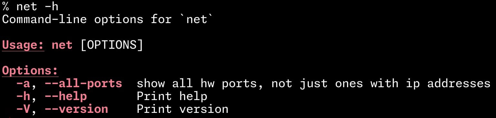
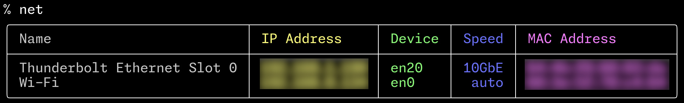
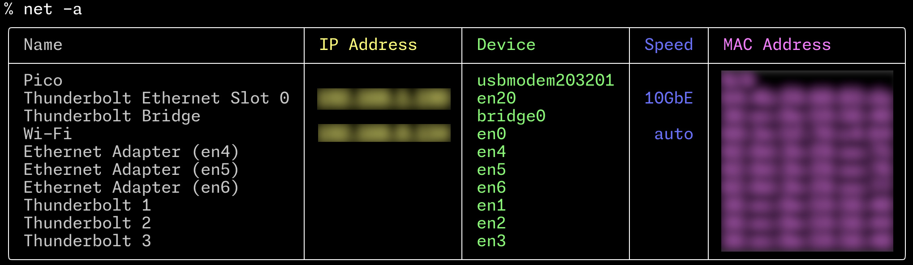

# net
Pretty cli display of network info on a Mac

* Shows Hardware Ports with assigned IP addresses, in preferred order
* Uses `networksetup -listallhardwareports` to get Hardware Ports list
* Uses `networksetup -listnetworkserviceorder` to display in service order

---

---

---

Use `-a` to include ports without IP addresses  

